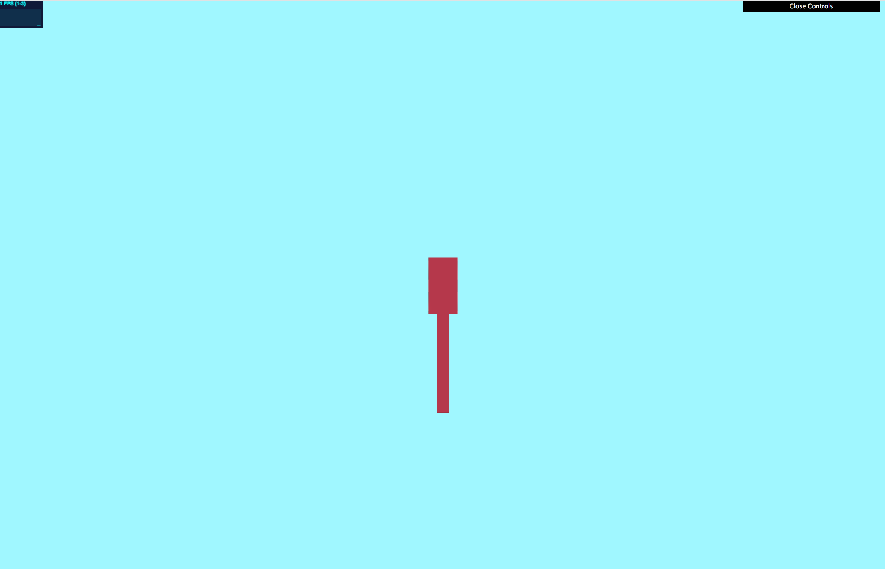
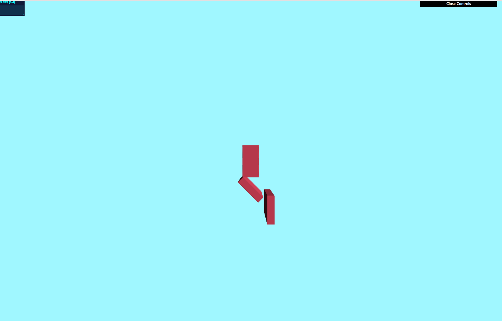
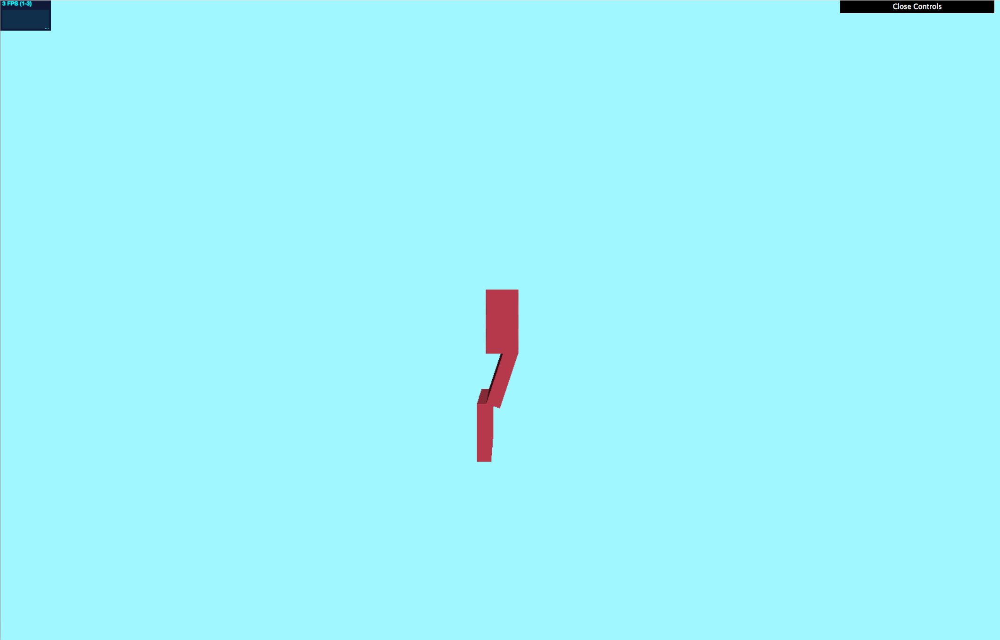

# final_project
CIS 566 Final Project

Evelyn Bailey

ebail

Project: https://eviebail.github.io/final_project/

Website: https://evelyn.pb.studio

Features

System Architecture:

For this project, I organized the architecture of the creature into three classes: a Character container class that has a list of Leg objects and keeps track of the center position and orientation of the body of the creature; a Leg class that stores the position, orientation, and scale for each joint in the character; and a Limb class that stores a list of Legs and computes the rotations for each Leg so that the end Leg joint is rotated to a target position.

  Character: 
      Constructor: Given a beginning position, number of Limbs, and number of Joints, the constructor creates a base position, orientation, and scale for the body of the creature, and populates its legJoints member field, which is a list of Limbs. It creates numJoints Leg objects, offsetting the first by root position + y scale * root orientation and the rest by previous Leg position + prevoius y scale * previous root orientation, and stores them in a Limb. 
      getVBOData: Returns the position, scale, and row vectors for the rotation matrix for the base body and all joints stored in the limbs. 
      moveToTarget: Calls the CCD function of each Limb stored in this instance on an input target position.
      Generate and Bind Walk Cycle: GenerateWalkCycle creates a walk cycle about the point (0,0,0). I chose to simulate a walk by creating positions that form a U shape about the center position. BindWalkCycle takes the array of points computed in GenerateWalkCycle and offsets them by the position of the end Joint for each Limb in this instance and stores it in a 2D array of walk cycle positions.
  
  Leg: Container Class that stores the position, scale, orientation, and rotation matrix information. The orientation is used to compute the new position of joints lower in the chain by computing position + y scale * orientation.
      
  Limb:
      CCD: Implements CCD on the set of Legs contained in the instance of this class. For each joint, starting from the first to the joint just before the last, it computes the vector from the current joint position to the end joint position (Pe) and the vector from the current joint position to the target position (Pt). It computes the theta of rotation using the dot product of Pe - Pt divided by the length of Pe - Pt, and the axis of rotation is computed by taking the dot of Pe - Pt / length(Pe - Pt). Using this information, it updates the orientation vector and rotation matrix stored in this joint. It then updates the position of all child joints by computing the position + y scale * new orientation for each joint lower in the chain. This is repeated for each joint in the chain. Finally, the end joint's orientation is set to its parent's orientation to properly orient the foot.
  
Inverse Kinematics:

  CCD:
  
Animation:

  Target Positions
  
Rendering:

  Rendering Joint Structure:
  
  Instanced Rendering:
  
  Shading:
  
  

Features Completed So Far:

I set up the system architecture in how I wanted to organize the data by creating a Character, Limb, and Leg class. The Character class stores the position, scale, and orientation of the base object of the creature, as well as a list of Limbs which contain information about the creature's arms and legs. Each Limb holds a collection of Legs and handles computing CCD, given a target position. 

I implemented the CCD function that orients the end joint to the target position, and for each joint from the end joint to the base joint computes the theta needed to rotate the end joint closer to the target. Once each joint has been rotated, I reorient the end joint to the target to ensure the orientation is correct given the new position.

To keep track of the relative position, orientation and scale of each joint, I store this information in the Leg class. Once I compute the theta and axis of rotation for each joint, I update the rotation matrix and orientation vector for each joint. I also recompute the position of all child joints of the current joint to ensure that their world space position is updated properly.

In the Character class, I implemented a getVBOData class that stores all position, scale, rotation matrix information, and forward/right/up vectors in a vec3[] that is passed to the shader. This information is then used to deform the ray to get the position the SDFs in space.

In the fragment shader, I set up ray marching to draw the boxes on screen by offseting the samplePoint by the position of the limb, then multiplying by the inverse of the rotation matrix assembled by putting the matrix row information that was passed to the shader, and then dividing the input point by the scale and multiplying the result by the max scale component to preserve scale in rotation.

Issues:
In addition to this, I attempted to create bounding boxes for the base and limbs of the creature because the frame rate is pretty low. I couldn't quite get it working correctly because whenever I rotated the camera, the shape would disappear. This suggests that I need to somehow make sure the bounding box is transforming how the camera moves, but I am not sure how to do this yet.

There are also still a few bugs with the IK function. 1. The rotation is about the center of the object as of right now. I initially changed the order of translate, rotate, scale to rotate, translate, scale with an offset to rotate about the corner, but I ran into other bugs so I reverted back to rotation about the center until I fix, 2) When rotating from rest to a target, the IK works, but it rotates from this state to another target position, the rotation of the root leg looks correct, but the position of the end joint is off. I am currently trying to debug and figure out why this is the case. 

Features to Finish:

Fix all the bugs mentioned in the Issues section.

Figure out a way to import animation info for the base animation.

Create aesthetic-looking creatures that look cool.

Add controls to switch between different types of creatures.

Creature base position using data passed to the GPU

Different orientations of the limbs after it has rotated to a target position. (Rotation is about center so it looks off)

