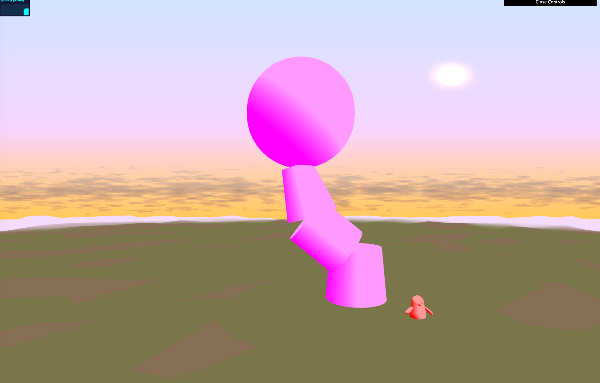

# final_project
CIS 566 Final Project

Evelyn Bailey

ebail

Project: https://eviebail.github.io/final_project/

Website: https://evelyn.pb.studio

  Blue

  Flower

Features

System Architecture:

For this project, I organized the architecture of the creature into three classes: a Character container class that has a list of Leg objects and keeps track of the center position and orientation of the body of the creature; a Leg class that stores the position, orientation, and scale for each joint in the character; and a Limb class that stores a list of Legs and computes the rotations for each Leg so that the end Leg joint is rotated to a target position.

  Character: 
  
      Constructor: Given a beginning position, number of Limbs, and number of Joints, the constructor creates a base position,            
                   orientation, and scale for the body of the creature, and populates its legJoints member field, which is a list 
                   of Limbs. It creates numJoints Leg objects, offsetting the first by root position + y scale * root orientation 
                   and the rest by previous Leg position + prevoius y scale * previous root orientation, and stores them in a 
                   Limb. 
                   
      getVBOData: Returns the position, scale, and row vectors for the rotation matrix for the base body and all joints stored in 
                  the limbs. 
                  
      moveToTarget: Calls the CCD function of each Limb stored in this instance on an input target position.
      Generate and Bind Walk Cycle: GenerateWalkCycle creates a walk cycle about the point (0,0,0). I chose to simulate a walk by 
                  creating positions that form a U shape about the center position. BindWalkCycle takes the array of points       
                  computed in GenerateWalkCycle and offsets them by the position of the end Joint for each Limb in this instance 
                  and stores it in a 2D array of walk cycle positions.
  
  Leg: 
  
      Container class that stores the position, scale, orientation, and rotation matrix information. The orientation is used to 
      compute the new position of joints lower in the chain by computing position + y scale * orientation.
      
  Limb:
  
      CCD: Implements CCD on the set of Legs contained in the instance of this class. For each joint, starting from the first to 
           the joint just before the last, it computes the vector from the current joint position to the end joint position (Pe) 
           and the vector from the current joint position to the target position (Pt). It computes the theta of rotation using 
           the dot product of Pe - Pt divided by the length of Pe - Pt, and the axis of rotation is computed by taking the dot of 
           Pe - Pt / length(Pe - Pt). Using this information, it updates the orientation vector and rotation matrix stored in 
           this joint. It then updates the position of all child joints by computing the position + y scale * new orientation for 
           each joint lower in the chain. This is repeated for each joint in the chain. Finally, the end joint's orientation is 
           set to its parent's orientation to properly orient the foot.
           

  While testing the InverseKinematics for a joint chain, I rendered simple cones to ensure the rotation is correct. The penguin represents the target position to which the leg must rotate to. Each joint orients itself to the target positon and updates the position of all its joint children. CCD starts from the closest joint to the end joint and iterates to the root joint.

  
  Rendering:

    Rendering Joint Structure: Main renders the character by loading obj assets for the body, beginning joint, middle joint, end joint (foot), and any accessories for the characters and populating the information for vs_Offset (vector to offset the instance object to the position of the joint or body part), vs_Color, vs_Scale, vs_Type (used in the fragment shader to determine how to shade the object), and three vectors representing the rows of the rotation matrix of the joint.
  
    Instanced Rendering: For the creatures, main uses an instancedShader where a mesh or object is created once and drawn multiple times. This is accomplished by keeping track of the number of instances to be drawn and setting up instanced variables like vs_Translate and vs_Scale (described above) that have a separate value for each instance of the object.
    

      Initial rendering of the creature based on the information stored in creature without any shading.

  
    Shading: This project uses three shaders - one for the sky, one for the ground plane, and one for the creature.
         
         Sky Shader: The base color is a linear interpolation from the purple sky color and the more orange horizon color. The    
         color of the sun is then added to the base as well as a cloud color based on fbm noise using the position of fs_Pos. 
         (Adapted from https://www.shadertoy.com/view/XlsXDB).
         
         Ground Shader: The vertex shader offsets the position of the plane vertices using worley noise. For color, if the height 
         is below a certain threshold, the base color is brown for dirt and green for grass otherwise. Added to this color is a 
         Voronoi noise (as implemented by IQ) to create a stylized texture for the ground.
         
         Instanced Shader: For the base color of the body of the creature, I use diffuse lighting and subtract fbm noise from the 
         color for Blue and worley noise for Flower Pot. The eyes use blinn shading to get a specular highlight, while the middle 
         joints lerp between a base color and the color of the foot joint.
  

  Finished, shaded version of the creature Blue

  Finished, shaded version of the creature Flower

